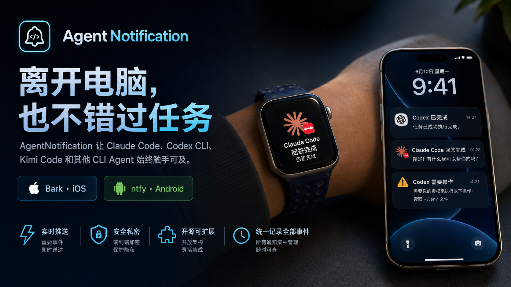
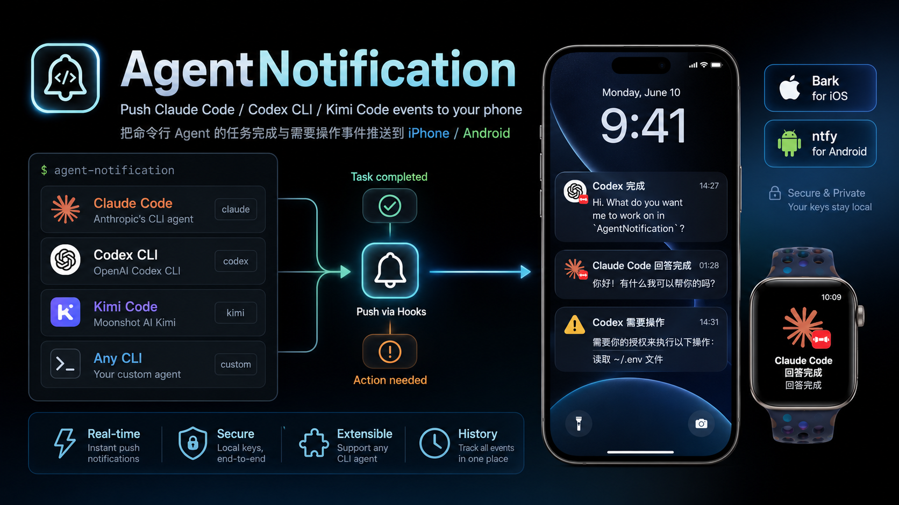

# AgentNotification

把 **Claude Code / OpenAI Codex CLI / Kimi Code CLI** 以及任意其他命令行 agent 的"任务完成"和"需要操作"事件，推送到你的 **iOS（Bark）/ Android（ntfy）手机**。



## 为什么需要 AgentNotification

跑长任务时常常想离开电脑，但又怕 agent 卡在权限确认上 — Claude Code 自带的桌面通知到不了手机。已有的 Bark/ntfy/Pushover 脚本各自为政：每接入一个 agent 就要重写一份摘要、过滤、退出码处理。本项目把这些黏合代码抽成稳定的子命令，新增 agent 只需配一行 hook 或包一层 `agentnotify wrap`。

## 通道

| 通道 | 平台 | 说明 |
|------|------|------|
| **Bark** | iOS | 开源 App，扫码取 device key，可用官方服务 `api.day.app` 或自建 |
| **ntfy** | Android | 完全开源，`ntfy.sh` 公共服务或自建。|

`init` 默认按手机系统单选一条最稳通道(iOS→Bark / Android→ntfy);进阶用户想多路并发,手动编辑 `~/.config/agentnotify/config.toml` 把另一条加进 `backends` 数组即可。

## 安装

AgentNotification 需要 **Python ≥ 3.11**（使用了标准库 `tomllib`）。推荐先建一个干净的 conda 环境，再在这个环境里安装，避免系统 Python 版本过低或依赖混在一起。

```bash
# 1. 创建并进入 Python 3.11+ 环境
conda create -n agentnotify python=3.11 -y
conda activate agentnotify

# 2. 更新 pip，并从 GitHub 安装
python -m pip install -U pip
python -m pip install git+https://github.com/wmzspace/AgentNotification

# 3. 确认命令可用
agentnotify --help
```

如果要从源码安装或参与开发：

```bash
git clone https://github.com/wmzspace/AgentNotification.git
cd AgentNotification
conda create -n agentnotify python=3.11 -y
conda activate agentnotify
python -m pip install -U pip
python -m pip install -e .
```

`questionary` 会作为依赖自动安装。已经有可靠的 Python 3.11+ 环境时，也可以用 `pipx` 安装到隔离环境：

```bash
pipx install --python python3.11 git+https://github.com/wmzspace/AgentNotification
```

## 首次配置

```bash
agentnotify init
```

交互式流程(用 ↑↓ 选,Space 多选,Enter 确认):

1. **手机系统**:iOS / Android。iOS 走 Bark(iOS 的后台限制让 ntfy 推送严重延迟,所以不再提供选项);Android 走 ntfy。
2. **填通道凭据**:Bark device key(粘整段推送 URL 也行,会自动提取)或 ntfy topic。
3. **可选 — 自动注入 agent hook 配置**:Claude Code (`~/.claude/settings.json`) / Codex CLI (`~/.codex/config.toml`) / Kimi Code (`~/.kimi/config.toml`)。
   - 修改前会把原文件备份到同目录:`settings.json.agentnotify-bak-<YYYYMMDD-HHMMSS>`。
   - 已经注入过的 hook 会被识别并跳过(幂等),不会重复触发推送。
   - 对应 agent 目录不存在时(没装那个 agent)直接跳过提示。

也可全用环境变量（CI / 容器友好）：

```bash
export AGENTNOTIFY_BARK_KEY=xxx
export AGENTNOTIFY_NTFY_TOPIC=my-secret-topic
export AGENTNOTIFY_BACKENDS=bark,ntfy   # 可选，缺省按存在的 key 推断
```

环境变量始终覆盖文件值。

## 验证

```bash
agentnotify send "测试" "Hello from AgentNotification"
agentnotify send --dry-run "测试" "看请求体而不真发"
```



## 接入各 agent

| Agent | 方式 | 文档 |
|-------|------|------|
| Claude Code | 原生 Stop / Notification / PermissionRequest hook | [docs/claude-code.md](docs/claude-code.md) |
| OpenAI Codex CLI | 原生 `[[hooks.Stop]]` + `[[hooks.PermissionRequest]]`(Codex 8+) | [docs/codex.md](docs/codex.md) |
| Kimi Code CLI | 原生 Stop / Notification hook | [docs/kimi.md](docs/kimi.md) |
| 任意其他 CLI | `agentnotify wrap` | [docs/wrapper.md](docs/wrapper.md) |

> 三大 agent 都可以让 `agentnotify init` 自动注入 hook 配置(带备份、幂等、绝对路径),不必手动编辑;手动写法见各 docs。

最小示例 — Claude Code 的 `~/.claude/settings.json`：

```json
{
  "hooks": {
    "Stop": [{ "matcher": "", "hooks": [{ "type": "command", "command": "agentnotify hook claude-stop 2>/dev/null || true", "async": true }]}],
    "Notification": [{ "matcher": "", "hooks": [{ "type": "command", "command": "agentnotify hook claude-notification 2>/dev/null || true", "async": true }]}],
    "PermissionRequest": [{ "matcher": "", "hooks": [{ "type": "command", "command": "agentnotify hook claude-permission 2>/dev/null || true", "async": true }]}]
  }
}
```

最小示例 — Codex CLI 的 `~/.codex/config.toml`(Codex 8+,追加在文件末尾):

```toml
[[hooks.Stop]]

[[hooks.Stop.hooks]]
type = "command"
command = "agentnotify hook codex-stop 2>/dev/null || true"
timeout = 30
```

旧版 Codex(只支持 `notify = [...]`)的写法见 [docs/codex.md](docs/codex.md#旧的-notify--方式)。

最小示例 — Kimi Code CLI 的 `~/.kimi/config.toml`(改 `hooks = []` 那一行,不是追加 `[[hooks]]`):

```toml
hooks = [
    { event = "Stop", command = "agentnotify hook kimi-stop 2>/dev/null || true", timeout = 10 },
    { event = "Notification", command = "agentnotify hook kimi-notification 2>/dev/null || true", timeout = 10 },
]
```

最小示例 — 任何无 hook 机制的 agent,用 wrapper:

```bash
agentnotify wrap --label "myagent" -- my-cli --task "重构 storage 模块"
```

## 命令速查

```
agentnotify init                         # 交互生成配置 + 可选注入各 agent hook
agentnotify send TITLE [BODY] [--dry-run --url ... --priority N --group ...]
agentnotify hook {claude-stop|claude-notification|claude-permission|kimi-stop|kimi-notification|codex-stop|codex-permission|codex} [JSON]
agentnotify wrap [--label LABEL] -- CMD ARGS...
```

所有子命令都接受 `--dry-run`，dry-run 不发任何网络请求，只打印将要发送的内容。

## 配置文件参考

完整字段说明见 [`config.example.toml`](config.example.toml)。配置文件默认 chmod 0600；`config.toml` 已在 `.gitignore` 中防误提交。

## 设计取舍

- **`init` 自动注入 agent 配置,但永远先备份**。各 agent 配置文件(`~/.claude/settings.json` / `~/.codex/config.toml` / `~/.kimi/config.toml`)被修改前都会写一份 `*.agentnotify-bak-<时间戳>` 到同目录,可一行 `mv` 回滚。注入只追加/合并,不覆盖用户已有 hook。
- **Hook 失败永不阻断 agent**。即使推送失败、配置缺失，`agentnotify hook ...` 也返回 0；只在 stderr 打印诊断。
- **Claude 三类事件主动去重**：`PermissionRequest` 独占权限通知(payload 自带 `tool_name` + `tool_input`,信息更丰富);`Notification` 跳过 `permission_prompt` 和 `waiting for input`,只留 `idle_prompt` / `auth_success` 等真正没人覆盖的事件,避免 Stop / Notification / PermissionRequest 三响。
- **任务摘要分级截断**：按句号 → 半句号 → 空格三级回退截断到 120 字符,便于在通知中心阅读。
- **绝对路径 over PATH**。注入到 agent 配置的 hook command 写绝对路径(`shutil.which` 解析),避免 Codex/Kimi 子进程 PATH 不全(conda/pyenv 未激活)时找不到 `agentnotify`。
- **iOS 默认只走 Bark**。Apple 后台限制让 ntfy 公共服务的横幅推送严重不可靠,init 直接屏蔽这个选项,避免新用户踩坑。
- **极小的依赖面**。除 `questionary`(交互式选择器)外仅用 Python 3.11+ 标准库,网络全走 `urllib`,TOML 解析用 `tomllib`。

## Android ntfy 的常见坑

如果你在 Android ntfy App 里看到红色 `Software caused connection abort` / `SocketException` 之类的报错 —— **这通常不是 agentnotify 的问题**。`agentnotify send` 已经把消息 POST 到 ntfy 服务器,推送是否抵达手机要看客户端那条长连接是否还活着。常见原因和处理:

- **省电策略杀后台连接（最高频）**。国产 ROM(MIUI / ColorOS / HarmonyOS / EMUI / Magic OS …) 默认会冻结 ntfy 的后台进程。解决:系统设置 → 应用管理 → ntfy → 电池/省电 → 设为"无限制"/"允许后台活动"/"允许自启动"，并在"最近任务"里把 ntfy 锁住。这一步能解决 90% 的"漏推送"。
- **公共 `ntfy.sh` 会主动断闲置连接**。客户端重连后会拉取 ~12h 内的离线消息,所以**红色报错出现 ≠ 通知会丢**,只是连接掉了一瞬间。如果通知最终能收到,无视即可。
- **网络切换**(4G ↔ WiFi、地铁信号差)也会触发同款 abort,同样靠重连恢复。
- **真的丢消息怎么办**:
  1. 在 ntfy App → Settings → Connection protocol 切到 **Instant delivery (WebSocket)**,并确保 App 拿到了不受限的电池权限。
  2. 长期方案:自建 ntfy server(放在你常开的 NAS / VPS / 家庭服务器),延迟和稳定性都远好于公共 `ntfy.sh`,然后把 `~/.config/agentnotify/config.toml` 的 `[ntfy].server` 改成自建地址即可。
  3. 退路:`backends = ["ntfy", "bark"]` 双通道并发推,任一条到达就算成功。

判断到底是 agentnotify 还是 ntfy 的问题:跑 `agentnotify send --dry-run "x" "y"`,看打印的请求体合不合理;再去掉 `--dry-run` 真发一次,服务端 200 就说明 agentnotify 这边没毛病,后续都是客户端/网络/省电的事。

## 许可证

MIT
